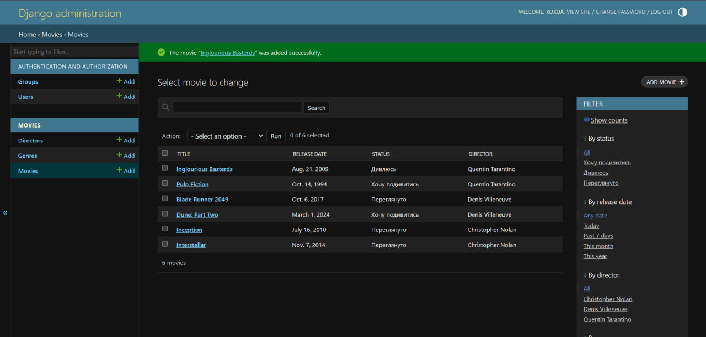

# Movie Tracker

Django-застосунок для обліку фільмів, режисерів та жанрів із відстеженням статусу перегляду.

## Моделі
- Director — режисер (ім'я, країна, дата народження)
- Genre — жанр
- Movie — фільм (ForeignKey на Director, ManyToMany на Genre, статус через choices)

## Як запустити
python -m venv venv
.\venv\Scripts\activate
pip install django
python manage.py migrate
python manage.py runserver

## Скріншот адмінки
