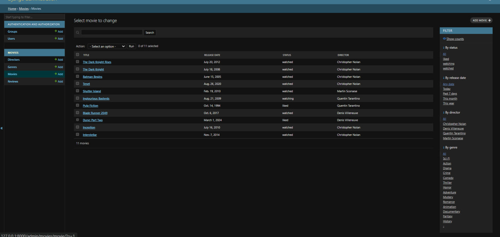

# Movie Tracker

Django application for tracking movies, directors, and genres with watch status management.

## Models
- Director — director (name, country, birth date)
- Genre — genre
- Movie — movie (ForeignKey to Director, ManyToMany to Genre, status via choices)

## How to run
python -m venv venv
# On Linux/macOS:
source venv/bin/activate
# On Windows:
venv\Scripts\activate
pip install -r requirements.txt
cp .env.example .env        
python manage.py migrate
python manage.py runserver

## Admin screenshot

